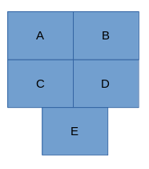
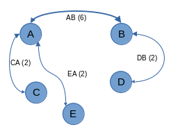
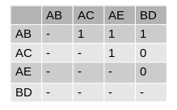

---
output:
  pdf_document: 
    fig_caption: true
  html_document: default
---

```{r, message=FALSE, echo=FALSE, results='hide'}
## Import libraries
library(knitr)
library(tidyverse)
library(tidygraph)
library(ggraph)
library(igraph)
library(tmap)
library(sf)
library(RColorBrewer)
options(scipen = 999)
```

```{r, echo=FALSE, fig.align='center', fig.width=10, fig.height=6, fig.cap="Conceptual model of transportation dynamics"}
knitr::include_graphics("./images/triboro-conceptual-model-original.png")
```


```{r, message=FALSE, echo=FALSE, results='hide'}
### Import Files

## LODES data
nys_od <- readr::read_csv('data/ny_od_main_JT00_2019.csv')
## Areas for all nyc NTAs
nyc_nta_borders <- sf::st_read('data/nyc_2010_nta_borders.geojson')
## Dataset to link census tracts with their NTA
nyc_nta_tract_equiv <- readxl::read_xlsx('data/nyc_2010_census_tract_nta_equiv.xlsx')

## The number of trains that are required for the trip
subway_lines <- readr::read_csv('data/nta-subway-lines.csv')

## The amount of time taken to travel by subway, car, or foot
subway_times <- readr::read_csv('data/nta-subway-times.csv')
driving_times <- readr::read_csv('data/nta-driving-times.csv')
walking_times <- readr::read_csv('data/nta-walking-times.csv')

## Infrastructure
nyc_boro_borders <- sf::st_read("./data/boro_boundaries.geojson")
major_roads <- sf::st_read("./data/DCM_ArterialsMajorStreets.geojson")
subways <- sf::st_read("./data/subway_lines.geojson")
```


```{r, message=FALSE, echo=FALSE, results='hide', warning=FALSE}

### Processing of data used throughout project

bk_name <- "Brooklyn"
bk_county_code <- "047"
bk_parks <- "BK99"

bk_nta_border <- nyc_nta_borders %>%
  dplyr::filter(BoroName == bk_name)  %>%
  dplyr::filter(NTACode != bk_parks) %>%
  dplyr::select("NTACode", "Shape__Area") %>%
  dplyr::arrange(
    order_by = NTACode
  )

bk_nta_centers <- bk_nta_border %>%
  dplyr::mutate(
    geometry = sf::st_point_on_surface(geometry)
  ) %>%
  dplyr::select(NTACode)

bk_nta_tract_equiv <- nyc_nta_tract_equiv %>%
  dplyr::filter(borough_name == bk_name) %>%
  dplyr::filter(nta_code != bk_parks) %>%
  dplyr::rename(tract = census_tract) %>%
  dplyr::select("tract", "nta_code")

od <- nys_od %>%
  dplyr::filter(
    stringr::str_sub(as.character(w_geocode), 3, 5) == bk_county_code &
    stringr::str_sub(as.character(h_geocode), 3, 5) == bk_county_code 
  ) %>%
  dplyr::mutate(
   w_tract = stringr::str_sub(as.character(w_geocode), 6, 11)
  ) %>%
  dplyr::mutate(
   h_tract = stringr::str_sub(as.character(h_geocode), 6, 11)
  ) %>%
  dplyr::select("w_tract", "h_tract", "S000") %>%
  dplyr::left_join(bk_nta_tract_equiv, c("w_tract" = "tract")) %>%
  dplyr::rename(w_nta_code = nta_code) %>%
  dplyr::left_join(bk_nta_tract_equiv, c("h_tract" = "tract")) %>%
  dplyr::rename(h_nta_code = nta_code) %>%
  dplyr::select("h_nta_code", "w_nta_code", "S000") %>%
  dplyr::filter(w_nta_code != bk_parks & h_nta_code != bk_parks) 

bk_boro_border <- nyc_boro_borders %>%
  dplyr::filter(boro_name == bk_name)

bk_subways <- subways %>%
  sf::st_intersection(bk_boro_border)

bk_major_roads <- major_roads %>%
  sf::st_intersection(bk_nta_border)
```

    
```{r, message = FALSE, echo=FALSE, results='hide', warning=FALSE}

### Distribution of job counts
job_counts <- od %>%
  dplyr::group_by(w_nta_code) %>%
  dplyr::summarise(
    S000 = sum(S000),
  ) %>%
  unique() %>%
  dplyr::left_join(
    bk_nta_border, c("w_nta_code" = "NTACode")
  ) %>%
  mutate(
    S000_km2 = S000 / (Shape__Area / 1e6),
    log_S000_km2 = log(S000_km2)
  ) %>% 
  sf::st_as_sf()
```


```{r, message=FALSE, echo=FALSE, fig.width = 10, fig.height = 6, fig.cap="Frequency of job counts in each NTAs, standardized by the area of the NTA."}

ggplot(job_counts) +
  ggtitle("Frequency of job counts for NTAs") +
  xlab("Jobs per square km") +
  ylab("Number of NTAs with value") +
  geom_histogram(aes(x = S000_km2), fill = "steelblue", color = "grey", bins = "30")

```
```{r, message=FALSE, echo=FALSE, fig.width = 10, fig.height = 6, fig.cap="Frequency of job counts in each NTAs, standardized by the area of the NTA and tranformed with a natural log."}
ggplot(job_counts) +
  ggtitle("Frequency of the natural log for job counts for NTAs") +
  xlab("Natural log of jobs per square km") +
  ylab("Number of NTAs with value") +
  geom_histogram(aes(x = log_S000_km2), fill = "steelblue", color = "grey", bins = "30")
```


```{r, message=FALSE, echo=FALSE}
## Constant for color palette
S000_count_colors = "BuGn"
```


```{r, message=FALSE, echo=FALSE, fig.width = 10, fig.height = 12, fig.cap="Number of jobs in each NTA tract. Job count is calculated from the sum of all trips which end in that NTA. It is standardized by the total area of the NTA. It is also transformed with a natural log."}

## Map of job counts in NTAs
tmap::tm_shape(job_counts) + 
  tmap::tm_polygons(
    col = "log_S000_km2",
    style = "jenks",
    title = "Jobs/km2\n(Nat. log)",
    palette = brewer.pal(5, S000_count_colors) 
  ) + 
  tmap::tm_layout(
    legend.outside = TRUE,
  )
```

```{r, message = FALSE, echo=FALSE}
## Use the NTA commute data that is available in any of the infrastructure data
## (Subway times is an arbitrary choice among the suitable files)
commute_counts <- subway_times %>%
  dplyr::select(-seconds_in_transit) %>%
  dplyr::left_join(bk_nta_border, c("nta_one" = "NTACode")) %>%
  dplyr::rename(
    shape_area_one = Shape__Area,
    geometry_one = geometry,
  ) %>%
  dplyr::left_join(bk_nta_border, c("nta_two" = "NTACode")) %>%
  dplyr::rename(
    shape_area_two = Shape__Area,
    geometry_two = geometry
  ) %>%
  dplyr::mutate(
    S000_km2 = S000 / ((shape_area_one / 1e6) + (shape_area_two / 1e6)),
    log_S000_km2 = log(S000_km2)
  )
```


```{r, message = FALSE, echo=FALSE}

### Global Moran's I

subway_times <- subway_times %>%
  dplyr::mutate(
    log_S000 = log(S000),
    S000_km2 = commute_counts$S000_km2,
    log_S000_km2 = commute_counts$log_S000_km2,
    i_seconds_in_transit = 1 / (seconds_in_transit^(1/8))
  )

subway_times <- subway_times %>%
  dplyr::mutate(
    i_c_seconds_in_transit = ifelse(subway_lines$line_count > 0, i_seconds_in_transit, 0),
  ) 

subway_graph <- subway_times %>%
  dplyr::select(
    c(
      nta_one,
      nta_two,
      i_c_seconds_in_transit
    )
  ) %>%
  dplyr::rename(
    from = nta_one,
    to = nta_two,
    weight = i_c_seconds_in_transit,
  ) %>%
  igraph::graph.data.frame(
    directed = FALSE
  ) 

subway_weights <- subway_graph %>%
  igraph::as_adjacency_matrix(attr = "weight") %>%
  spdep::mat2listw()

driving_times <- driving_times %>%
  dplyr::mutate(
    log_S000 = log(S000),
    S000_km2 = commute_counts$S000_km2,
    log_S000_km2 = commute_counts$log_S000_km2,
    i_seconds_in_traffic = 1 / seconds_in_traffic^(1/8)
  )


driving_weights <- driving_times %>%
  dplyr::select(
    c(
      nta_one,
      nta_two,
      i_seconds_in_traffic
    )
  ) %>%
  dplyr::rename(
    from = nta_one,
    to = nta_two,
    weight = i_seconds_in_traffic
  ) %>%
  igraph::graph.data.frame(
    directed = FALSE
  ) %>%
  igraph::as_adjacency_matrix(attr = "weight") %>%
  spdep::mat2listw()

walking_times <- walking_times %>%
  dplyr::mutate(
    log_S000 = log(S000),
    S000_km2 = commute_counts$S000_km2,
    log_S000_km2 = commute_counts$log_S000_km2,
    i_seconds_of_walking = 1 / seconds_of_walking^(1/8)
  )

walking_weights <- walking_times %>%
  dplyr::select(
    c(
      nta_one,
      nta_two,
      i_seconds_of_walking
    )
  ) %>%
  dplyr::rename(
    from = nta_one,
    to = nta_two,
    weight = i_seconds_of_walking
  ) %>%
  igraph::graph.data.frame(
    directed = FALSE
  ) %>%
  igraph::as_adjacency_matrix(attr = "weight") %>%
  spdep::mat2listw()

queen_weights <- job_counts %>%
  spdep::poly2nb(c("w_nta_code")) %>%
  spdep::nb2listw(zero.policy = TRUE)
```


```{r, message=FALSE, echo=FALSE, results='hide', fig.width=10, fig.height=5, fig.cap="Global auto-correlation of job count using subway transit time for neighborhood wieghts"}

#### Subway

subway_global_morans <- spdep::moran.test(
  job_counts$log_S000_km2,
  subway_weights,
  zero.policy = TRUE,
)
print(subway_global_morans)

spdep::moran.plot(
  job_counts$log_S000_km2,
  subway_weights,
  zero.policy = TRUE,
  xlab = "Natural log jobs/km2",
  ylab = "Lagged natural log jobs/km2"
)
```


```{r, message=FALSE, echo=FALSE, results='hide', fig.width=10, fig.height=5, fig.cap="Global auto-correlation of job count using driving time for neighborhood wieghts"}

#### Driving

driving_global_morans <- spdep::moran.test(
  job_counts$log_S000_km2,
  driving_weights,
  zero.policy = TRUE,
)
print(driving_global_morans)

spdep::moran.plot(
  job_counts$log_S000_km2,
  driving_weights,
  zero.policy = TRUE,
  xlab = "Natural log jobs/km2",
  ylab = "Lagged natural log jobs/km2"
)
```


```{r, message=FALSE, echo=FALSE, results='hide', fig.width=10, fig.height=5,fig.cap="Global auto-correlation of job count using walking time for neighborhood wieghts"}

#### Walking

walking_global_morans <- spdep::moran.test(
  job_counts$log_S000_km2,
  walking_weights,
  zero.policy = TRUE,
)
print(walking_global_morans)

spdep::moran.plot(
  job_counts$log_S000_km2,
  walking_weights,
  zero.policy = TRUE,
  xlab = "Natural log jobs/km2",
  ylab = "Lagged natural log jobs/km2"
)
```


```{r, message=FALSE, echo=FALSE, results='hide', fig.width=10, fig.height=5, fig.cap="Global auto-correlation of job count using queens contiguity for neighborhood wieghts"}

#### Queens

queen_global_morans <- spdep::moran.test(
  job_counts$log_S000_km2,
  queen_weights,
  zero.policy = TRUE,
)
print(queen_global_morans)

spdep::moran.plot(
  job_counts$log_S000_km2,
  queen_weights,
  zero.policy = TRUE,
  xlab = "Natural log jobs/km2",
  ylab = "Lagged natural log jobs/km2"
)
```


```{r, message=FALSE, echo=FALSE, results='hide'}

### LISA

avg_jobs <- mean(job_counts$log_S000_km2)

classify_co_types <- function(mode_lisa, l_job_counts, avg_job_count) {
  mode_lisa %>%
    tibble::as_tibble() %>%
    magrittr::set_colnames(
      c("Ii","E.Ii","Var.Ii","Z.Ii","Pr(z > 0)") 
    ) %>%
    dplyr::mutate(
      co_type = dplyr::case_when(
        `Pr(z > 0)` > 0.05 ~ "Insignificant",
        `Pr(z > 0)` <= 0.05 & Ii >= 0 & l_job_counts >= avg_job_count ~ "HH",
        `Pr(z > 0)` <= 0.05 & Ii >= 0 & l_job_counts <  avg_job_count ~ "LL",
        `Pr(z > 0)` <= 0.05 & Ii < 0 &  l_job_counts >= avg_job_count ~ "HL",
        `Pr(z > 0)` <= 0.05 & Ii < 0 &  l_job_counts < avg_job_count ~ "LH"
      )
    )
}

subway_lisa <- spdep::localmoran(
  job_counts$log_S000_km2,
  subway_weights,
  zero.policy = TRUE,
  na.action = na.omit
) 

driving_lisa <- spdep::localmoran(
  job_counts$log_S000_km2,
  driving_weights,
  zero.policy = TRUE,
  na.action = na.omit
)

walking_lisa <- spdep::localmoran(
  job_counts$log_S000_km2,
  walking_weights,
  zero.policy = TRUE,
  na.action = na.omit
)

queen_lisa <- spdep::localmoran(
  job_counts$log_S000_km2,
  queen_weights,
  zero.policy = TRUE,
  na.action = na.omit
)

subway_classes <- classify_co_types(subway_lisa, job_counts$log_S000_km2, avg_jobs)
driving_classes <- classify_co_types(driving_lisa, job_counts$log_S000_km2, avg_jobs)
walking_classes <- classify_co_types(walking_lisa, job_counts$log_S000_km2, avg_jobs)
queen_classes <- classify_co_types(queen_lisa, job_counts$log_S000_km2, avg_jobs)

subway_bk_nta_border <- bk_nta_border %>%
  dplyr::mutate(
    co_type = ifelse(is.na(subway_classes$co_type), "Insignificant", subway_classes$co_type)
  )

driving_bk_nta_border <- bk_nta_border %>%
  dplyr::mutate(
    co_type = ifelse(is.na(driving_classes$co_type), "Insignificant",  driving_classes$co_type)
  )

walking_bk_nta_border <- bk_nta_border %>%
  dplyr::mutate(
    co_type = ifelse(is.na(walking_classes$co_type), "Insignificant", walking_classes$co_type)
  )

queen_bk_nta_border <- bk_nta_border %>%
  dplyr::mutate(
    co_type = ifelse(is.na(queen_classes$co_type), "Insignificant", queen_classes$co_type)
  )
```


```{r, message=FALSE, echo=FALSE}

### Queen Contiguity

queen_map <- tmap::tm_shape(queen_bk_nta_border) +
  tmap::tm_polygons(
    col = "co_type",
    title = "Clusters &\nOutliers",
    palette = c("red", "lightgrey", "steelblue", "seagreen"),
  ) + 
  tmap::tm_layout(
    legend.outside = TRUE,
    title = "Queen"
  )
```


```{r, message=FALSE, echo=FALSE}

#### Subway

subway_map <- tmap::tm_shape(subway_bk_nta_border) +
  tmap::tm_polygons(
    col = "co_type",
    palette = c("red", "goldenrod", "lightgrey", "steelblue"),
    title = "Clusters &\nOutliers"
  ) +
  tmap::tm_shape(bk_subways) +
  tmap::tm_lines(
    col = "rt_symbol",
    title.col = "Subway Routes"
  ) +
  tmap::tm_layout(
    legend.outside = TRUE,
    title = "Subway"
  )
```


```{r, message=FALSE, echo=FALSE}

#### Driving

driving_map <- tmap::tm_shape(driving_bk_nta_border) +
  tm_polygons(
    col = "co_type",
    palette = c("red", "goldenrod", "lightgrey", "steelblue", "seagreen"),
    title = "Clusters &\nOutliers"
  ) +
  tmap::tm_shape(bk_major_roads) +
  tmap::tm_lines(
    col = "route_type",
    lwd = 1.2,
    palette = c("purple", "black"),
    title.col = "Major strees &\narterials"
  ) +
  tmap::tm_layout(
    legend.outside = TRUE,
    title = "Driving"
  )
```


```{r, message=FALSE, echo=FALSE}

### Walking 

walking_map <- tmap::tm_shape(walking_bk_nta_border) +
  tm_polygons(
    col = "co_type",
    palette = c("red", "goldenrod", "lightgrey", "steelblue", "seagreen"),
    title = "Clusters &\nOutliers"
  ) +
  tmap::tm_layout(
    legend.outside = TRUE,
    title = "Walking"
  )
```


```{r, message=FALSE, echo=FALSE, warning = FALSE, fig.width=10, fig.height=12, fig.cap="Local auto-correlation for job count of NTAs. Each map utilizes a unique neighborhood weighting. Top left uses queen contiguity. Top right uses driving time in traffic and is overlayed with major roads. Bottom left uses walking time. Bottom right uses transit time on the subway and is overlayed with the subway network."}

tmap::tmap_arrange(queen_map, driving_map, walking_map, subway_map, nrow = 2, ncol = 2)

```


```{r, message=FALSE, echo=FALSE, fig.width = 10, fig.height = 6, fig.cap="Frequency of commute counts, standardized by the sum of the areas of the commute's origin and destination NTAs"}
ggplot(commute_counts) +
  ggtitle("Distribution of commutes") +
  xlab("Commutes per square km") +
  ylab("Number of NTA pairs with commute value") +
  geom_histogram(aes(x = S000_km2), fill = "steelblue", color = "grey", bins = 40)
```


```{r, message=FALSE, echo=FALSE, fig.width = 10, fig.height = 6, fig.cap="Frequency of the natural log of commute counts, standardized by the sum of the areas of the commute's origin and destination NTAs"}
ggplot(data = commute_counts) +
  ggtitle("Distribution of the natural log of commutes") +
  xlab("Natural log of commutes per square km") +
  ylab("Number of NTA pairs with commute value") +
  geom_histogram(aes(x = log_S000_km2), bins = 30, fill = "steelblue", color = "grey")
```


```{r, message = FALSE, echo=FALSE}
### Number of subway lines and commute count
subway_lines <- subway_lines %>%
  dplyr::mutate(
    line_count_ordinal = as.character(line_count),
    S000_km2 = commute_counts$S000_km2,
    log_S000_km2 = commute_counts$log_S000_km2,
  )
```


```{r, message=FALSE, echo=FALSE, fig.width = 10, fig.height = 12, fig.cap="Boxplot for the number of commutes, factored by the number of subway lines used during the commute. Commutes are transformed by a natural log and standardized by area"}

### Boxplot for subway line count

ggplot(data = subway_lines, aes(x = line_count_ordinal, y = log_S000_km2)) +
  ggtitle("Number of commutes for each level of subway lines used in commute") +
  xlab("Subway lines in trip") +
  ylab("Natural log of Commutes per km2") +
  geom_boxplot()
```


```{r, message=FALSE, echo=FALSE}

### Subway Transit time and commute count


subway_times_connected <- subway_times %>%
  dplyr::filter(
    subway_lines$line_count > 0 
  )
```


```{r, message = FALSE, echo=FALSE, fig.width=10, fig.height=6, fig.cap="Time in transit on the subway plotted against the number of commutes standardized by area. A smoother line is overlayed in blue."}

ggplot(data = subway_times_connected, aes(x = seconds_in_transit, y = S000_km2)) +
  geom_point() +
  ggtitle("Subway transit time and commutes") +
  xlab("Seconds in transit") +
  ylab("Commuts per km2") +
  stat_smooth()
```


```{r, message = FALSE, echo=FALSE, fig.width=10, fig.height=6, fig.cap="Time in subway transit is transormed by raising it to the power of one-eighth and taking the inverse. Commute count is transformed with the natural log. The values are plotted against each other. A smoother line is overlayed in blue."}

ggplot(data = subway_times_connected, aes(x = i_seconds_in_transit, y = log_S000_km2)) +
  ggtitle("Tranformed subway transit time and natural log of commutes") +
  xlab("1 / (seconds in transit^(1/8))") +
  ylab("Natural log of commutes per km2") +
  geom_point() +
  stat_smooth()
```


```{r, message=FALSE, echo=FALSE, fig.width=10, fig.height=12, results='hide', fig.cap="Diagnostic plots for the model of transformed subway transit time"}

### Subway model
subway_connected_model <- lm(subway_times_connected$log_S000_km2 ~ subway_times_connected$i_seconds_in_transit)
summary(subway_connected_model)

## diagnostic plots
par(mfrow=c(2,2))
plot(subway_connected_model, which = 1:4)
```


```{r, message = FALSE, echo=FALSE}
### Driving times for commutes


driving_times_reduced <- driving_times %>%
  dplyr::filter(
    trip %in% subway_times_connected$trip
  )
```


```{r, message = FALSE, echo=FALSE, fig.width=10, fig.height=6, fig.cap="Time driving in traffic plotted against the number of commutes standardized by area. A smoother line is overlayed in blue."}

ggplot(data = driving_times_reduced, aes(x = seconds_in_traffic, y = S000_km2)) +
  ggtitle("Driving in traffic time and commutes") +
  xlab("Seconds in traffic")+
  ylab("Commuts per km2") +
  geom_point() +
  stat_smooth()
```

```{r, message = FALSE, echo=FALSE, fig.width=10, fig.height=6, fig.cap="Time driving in traffic is transormed by raising it to the power of one-eighth and taking the inverse. Commute count is transformed with the natural log. The values are plotted against each other. A smoother line is overlayed in blue."}

ggplot(data = driving_times_reduced, aes(x = i_seconds_in_traffic, y = log_S000_km2)) +
  ggtitle("Transformed driving in traffic time and natural log of commutes") +
  xlab("1/(Seconds in traffic)^(1/8)")+
  ylab("Natural log of commuts per km2") +
  geom_point() +
  stat_smooth()
```

  
```{r, message=FALSE, echo=FALSE, fig.width=10, fig.height=12, results='hide', fig.cap="Diagnostic plots for the model of transformed driving time"}
## Driving linear model
driving_model <- lm(driving_times_reduced$log_S000_km2 ~ driving_times_reduced$i_seconds_in_traffic)
summary(driving_model)

par(mfrow=c(2,2))
plot(driving_model, which = 1:4)
```


```{r, message=FALSE, echo=FALSE}

### Walking time and commute count


walking_times_reduced <- walking_times %>%
  dplyr::filter(
    trip %in% subway_times_connected$trip
  )
```


```{r, message = FALSE, echo=FALSE, fig.width=10, fig.height=6, fig.cap="Time spent walking plotted against the number of commutes standardized by area. A smoother line is overlayed in blue."}
ggplot(data = walking_times_reduced, aes(x = seconds_of_walking, y = S000_km2)) +
  ggtitle("Walking times and commutes") +
  xlab("Walking time in seconds") +
  ylab("Commutes per km2") +
  geom_point() +
  stat_smooth()
```


```{r, message = FALSE, echo=FALSE, fig.width=10, fig.height=6, fig.cap="Time spent walking is transormed by raising it to the power of one-eighth and taking the inverse. Commute count is transformed with the natural log. The values are plotted against each other. A smoother line is overlayed in blue."}

ggplot(data = walking_times_reduced, aes(x = i_seconds_of_walking, y = log_S000_km2)) +
  ggtitle("Transformed walking times and natural log of commutes") +
  xlab("1/(seconds of walking)^(1/8)") +
  ylab("Commutes per km2") +
  geom_point() +
  stat_smooth()
```


```{r, message=FALSE, echo=FALSE, fig.width=10, fig.height=12, results='hide', fig.cap="Diagnostic plots for the model of transformed walking time"}

### Walking
walking_model <- lm(walking_times_reduced$log_S000_km2 ~ walking_times_reduced$i_seconds_of_walking)
summary(walking_model)


par(mfrow=c(2,2))
plot(driving_model, which = 1:4)
```

  
```{r, message=FALSE, echo=FALSE}
subway_connected_eq <- function(t) exp(subway_connected_model$coefficients[[1]] + subway_connected_model$coefficients[[2]] / t^(1/8))
driving_eq <- function(t) exp(driving_model$coefficients[[1]] + driving_model$coefficients[[2]] / t^(1 / 8))
walking_eq <- function(t) exp(walking_model$coefficients[[1]] + walking_model$coefficients[[2]] / t^(1 / 8))
```


```{r, message = FALSE, echo=FALSE, fig.width=10, fig.height=6, fig.cap="Models for transporation modes. Each model is only plotted from their minimum to maximum observed travel time."}
ggplot(
  dplyr::tibble(
    seconds = seq(from = 301, to = 15200, by = 14.9)
  ), aes(seconds)) +
  ggtitle("Predicted commutes for travel times") +
  xlab("Seconds of commuting") +
  ylab("Commutes per km2") +
  stat_function(fun = subway_connected_eq, aes(color = "subway"), xlim = c(min(subway_times_connected$seconds_in_transit), max(subway_times_connected$seconds_in_transit))) +
  stat_function(fun = driving_eq, aes(color = "driving"), xlim = c(min(driving_times_reduced$seconds_in_traffic), max(driving_times_reduced$seconds_in_traffic))) +
  stat_function(fun = walking_eq, aes(color = "walking"), xlim = c(min(walking_times_reduced$seconds_of_walking), max(walking_times_reduced$seconds_of_walking))) +
  scale_color_manual("Mode", values=c("steelblue", "goldenrod", "seagreen"))
```


```{r, message = FALSE, echo=FALSE, fig.width=10, fig.height=6, fig.cap="Models of transportation modes, zoomed on the range of 12min to 50mins. This range is seen in the travel time values for each transportation mode."}

# The 12 minutes is the lowest round minute in each transportation mode's range
# 50 minutes is a reasonable high end of commute times, in each mode's range.

ggplot(
  dplyr::tibble(
    seconds = seq(from = 720, to = 3000, by = 14.9)
  ), aes(seconds)) +
  ggtitle(
    "Predicted commutes for travel times",
    subtitle = "Zoom to commutes between 12 and 50 minutes"
    ) +
  xlab("Seconds of commuting") +
  ylab("Commutes per km2") +
  stat_function(fun = subway_connected_eq, aes(color = "subway")) +
  stat_function(fun = driving_eq, aes(color = "driving")) +
  stat_function(fun = walking_eq, aes(color = "walking")) +
  scale_color_manual("Mode", values=c("steelblue", "goldenrod", "seagreen"))
```


```{r, message=FALSE, echo=FALSE, results='hide'}
times_of_interest <- c(12, 25, 50)*60

## subway predictions
subway_predictions <- subway_connected_eq(times_of_interest)
subway_se <- summary(subway_connected_model)$sigma
subway_pred_low <- subway_predictions - (2*subway_se)
subway_pred_high <- subway_predictions + (2*subway_se)

## driving predictions
driving_prediction <- driving_eq(times_of_interest)
driving_se <- summary(driving_model)$sigma
driving_pred_low <- driving_prediction - (2*driving_se)
driving_pred_high <- driving_prediction + (2*driving_se)

## walking predictions
walking_predictions <- walking_eq(times_of_interest)
walking_se <- summary(walking_model)$sigma
walking_pred_low <- walking_predictions - (2*walking_se)
walking_pred_high <- walking_predictions + (2*walking_se)

predictions <- dplyr::tibble(
  Minutes = c("Twelve", "Twenty Five", "Fifty"),
  subway_predictions,
  subway_pred_low,
  subway_pred_high,
  driving_prediction,
  driving_pred_low,
  driving_pred_high,
  walking_predictions,
  walking_pred_low,
  walking_pred_high
)

print(predictions)
```


```{r, message=FALSE, echo=FALSE}

### Network autocorrelation
## Utility function that builds the edges between trips
build_edges <- function(nodes) {
  edges_from <- vector()
  edges_to <- vector()
  nodes_count <- length(nodes)
  for(i in 1:(nodes_count - 1)) {
    offset <- i + 1
    from_node <- nodes[i]
    from_nta_one <- stringr::str_sub(from_node, 1, 4)
    from_nta_two <- stringr::str_sub(from_node, 5, 8)
    for(j in offset:nodes_count){
      to_node <- nodes[j]
      are_neighbors <- stringr::str_detect(to_node, from_nta_one) | stringr::str_detect(to_node, from_nta_two)
      if (are_neighbors) {
        edges_from <- append(edges_from, from_node)
        edges_to <- append(edges_to, to_node)
      }
    }
  }
  return (tibble::tibble(from = edges_from, to = edges_to)) 
}
```


```{r, echo=FALSE, fig.align='center', fig.width=10, fig.height=6, fig.cap="Hypothetical NTA layout"}

```


```{r, echo=FALSE, fig.align='center', fig.width=10, fig.height=6, fig.cap="Hypothetical NTA network"}

```


```{r, echo=FALSE, fig.align='center', fig.width=10, fig.height=6, fig.cap="Matrix for hypothetical NTA network"}

```


```{r, echo=FALSE, fig.align='center', fig.width=10, fig.height=6, fig.cap="Complement for hypothetical NTA network"}

```


```{r, message=FALSE, echo=FALSE}
commute_nodes <- commute_counts %>%
  dplyr::select(
    c(trip, log_S000_km2)
  ) %>%
  dplyr::rename(
    name = trip
  )
commute_edges <- build_edges(commute_nodes$name)
commute_network <- tidygraph::tbl_graph(
  nodes = commute_nodes,
  edges = commute_edges,
  directed = FALSE
)
```


```{r, message=FALSE, echo=FALSE, warning=FALSE, results='hide', fig.width=10, fig.height=12, fig.cap="Global auto-correlation of commute network"}
#### Global Moran's I
commute_weights <- commute_network %>%
  igraph::as_adj() %>%
  spdep::mat2listw()

commute_global_morans <- spdep::moran.test(
  commute_nodes$log_S000_km2,
  commute_weights,
  zero.policy = TRUE
)

print(commute_global_morans)

spdep::moran.plot(
  commute_nodes$log_S000_km2,
  commute_weights,
  zero.policy = TRUE,
  xlab = "Natural log of commutes/km2",
  ylab = "Lagged natural log of commutes/km2"
)
```


```{r, message=FALSE, echo=FALSE}
#### LISA
commute_lisa <- spdep::localmoran(
  commute_nodes$log_S000_km2,
  commute_weights,
  zero.policy = TRUE,
  na.action = na.omit
)

avg_commute_count <- mean(commute_nodes$log_S000_km2)

commute_classes <- classify_co_types(commute_lisa, commute_nodes$log_S000_km2, avg_commute_count)

commute_network_cluster <- commute_network %>%
  tidygraph::activate(nodes) %>%
  dplyr::mutate(
    co_type  = commute_classes$co_type %>% tidyr::replace_na("Insignificant")
  )

commute_network_cluster_sig <- commute_network_cluster %>%
  dplyr::filter(co_type != "Insignificant")
```


```{r, message=FALSE, echo=FALSE, warning=FALSE}
commute_count_lines <- commute_counts %>%
  dplyr::mutate(
    center_one = sf::st_point_on_surface(geometry_one),
    center_two = sf::st_point_on_surface(geometry_two)
  ) %>%
  dplyr::mutate(
    geometry = sf::st_cast(sf::st_union(center_one, center_two), "LINESTRING")
  ) %>%
  dplyr::select(
    c(trip, log_S000_km2, geometry)
  ) %>%
  sf::st_as_sf() %>%
  dplyr::mutate(
    co_type  = commute_classes$co_type %>% tidyr::replace_na("Insignificant")
  ) 
```


```{r, message=FALSE, echo=FALSE}
all_auto <- tmap::tm_shape(bk_nta_border) +
  tmap::tm_polygons(
    col = "#eeeeee"
  ) + tmap::tm_shape(commute_count_lines) +
  tmap::tm_lines(
    col = "co_type",
    palette = c("red", "goldenrod", "white", "steelblue", "seagreen"),
    title.col = ""
  ) + 
  tmap::tm_layout(
    legend.outside = TRUE,
    legend.text.size = 1,
  )
```


```{r, message=FALSE, echo=FALSE}
hh_auto <- tmap::tm_shape(bk_nta_border) +
  tmap::tm_polygons(
    col = "#eeeeee"
  ) + tmap::tm_shape(commute_count_lines %>% filter(co_type == "HH")) +
  tmap::tm_lines(
    col = "co_type",
    palette = c("red"),
    title.col = ""
  ) + 
  tmap::tm_layout(
    legend.outside = TRUE,
    legend.text.size = 1,
    )
```


```{r, message=FALSE, echo=FALSE}
hl_auto <- tmap::tm_shape(bk_nta_border) +
  tmap::tm_polygons(
    col = "#eeeeee"
  ) + tmap::tm_shape(commute_count_lines %>% filter(co_type == "HL")) +
  tmap::tm_lines(
    col = "co_type",
    palette = c("goldenrod"),
    title.col = ""
  ) + 
  tmap::tm_layout(
    legend.outside = TRUE,
    legend.text.size = 1,
    )
```


```{r, message=FALSE, echo=FALSE}
insig_auto <- tmap::tm_shape(bk_nta_border) +
  tmap::tm_polygons(
    col = "#eeeeee"
  ) + tmap::tm_shape(commute_count_lines %>% filter(co_type == "Insignificant")) +
  tmap::tm_lines(
    col = "co_type",
    palette = c("black"),
    title.col = ""
  ) + 
  tmap::tm_layout(
    legend.outside = TRUE,
    legend.text.size = 1,
    )
```


```{r, message=FALSE, echo=FALSE}
lh_auto <- tmap::tm_shape(bk_nta_border) +
  tmap::tm_polygons(
    col = "#eeeeee"
  ) + tmap::tm_shape(commute_count_lines %>% filter(co_type == "LH")) +
  tmap::tm_lines(
    col = "co_type",
    palette = c("steelblue"),
    title.col = ""
  ) + 
  tmap::tm_layout(
    legend.outside = TRUE,
    legend.text.size = 1,
    )
```


```{r, message=FALSE, echo=FALSE}
ll_auto <- tmap::tm_shape(bk_nta_border) +
  tmap::tm_polygons(
    col = "#eeeeee"
  ) + tmap::tm_shape(commute_count_lines %>% filter(co_type == "LL")) +
  tmap::tm_lines(
    col = "co_type",
    palette = c("seagreen"),
    title.col = ""
  ) + 
  tmap::tm_layout(
    legend.outside = TRUE,
    legend.text.size = 1,
    )
```


```{r, message = FALSE, echo=FALSE, fig.width=10, fig.height=12, fig.cap="Local autocorrelation for commute network. Top left map shows all confidence types on one map. Top right shows Insignificant clusters. Middle left shows High High clusters. Middle right shows High Low clusters. Bottom left shows Low High clusters. Bottom right shows Low Low clusters"}

tmap::tmap_arrange(all_auto, insig_auto, hh_auto, hl_auto, lh_auto, ll_auto, nrow = 3, ncol = 2)

```


```{r, message=FALSE, echo=FALSE}
commute_count_lines_top <- commute_count_lines %>%
  dplyr::slice_max(
    order_by = log_S000_km2,
    n = 62
  ) 

 top_cotype <- tmap::tm_shape(bk_nta_border) +
  tmap::tm_polygons(
    col = "#eeeeee"
  ) + tmap::tm_shape(commute_count_lines_top) +
  tmap::tm_lines(
    col = "co_type",
    palette = c("red", "goldenrod", "black"),
    title.col = "Confidence Type"
  ) 
```


```{r, message=FALSE, echo=FALSE, warning=FALSE, fig.width=10, fig.height=6, fig.cap="Graph of the top 5% most popular commutes through brooklyn and their interactions with each other. The color of the node reflects its membership in one of three clusters"}

#### Visualization of network's complement and most popular trips
commute_nodes_top <- commute_nodes %>%
  dplyr::slice_max(
    order_by = log_S000_km2,
    n = 62
  )

commute_edges_top <- build_edges(commute_nodes_top$name)
commute_network_top <- tidygraph::tbl_graph(
  nodes = commute_nodes_top,
  edges = commute_edges_top,
  directed = FALSE
)

commute_network_top_clusters <- igraph::cluster_fast_greedy(commute_network_top)

total_trips_top = sum(commute_nodes_top$log_S000_km2)
ggraph::ggraph(
  commute_network_top,
  layout = "stress"
) +
  geom_edge_link() +
  geom_node_circle(aes(r = commute_nodes_top$log_S000_km2 / 75, fill = as.character(commute_network_top_clusters$membership))) +
  geom_node_text(aes(label = stringr::str_c(stringr::str_sub(name, 3,4), '&', stringr::str_sub(name, 7,8))), repel = TRUE) +
  scale_fill_manual(
    values = brewer.pal(3, "Dark2"),
    name = "Cluster "
    )
```


```{r, message=FALSE, echo=FALSE}

commute_count_lines_top_clusters <- commute_count_lines_top %>%
  dplyr::mutate(
    membership = as.character(commute_network_top_clusters$membership)
  )

top_cluster <- tmap::tm_shape(bk_nta_border) +
  tmap::tm_polygons(
    col = "#f9f9f9"
  ) + tmap::tm_shape(commute_count_lines_top_clusters) +
  tmap::tm_lines(
    col = "membership",
    palette = brewer.pal(3, "Dark2"),
    title.col = "Cluster"
  ) 
```


```{r, message = FALSE, echo=FALSE, fig.width=10, fig.height=6, fig.cap="Geospatial distribution of the top 5% most popular commutes through brooklyn. Left diagram is the confidence type of the commute. Right diagram is commute's membership in the network cluster"}

tmap::tmap_arrange(top_cotype, top_cluster)

```
